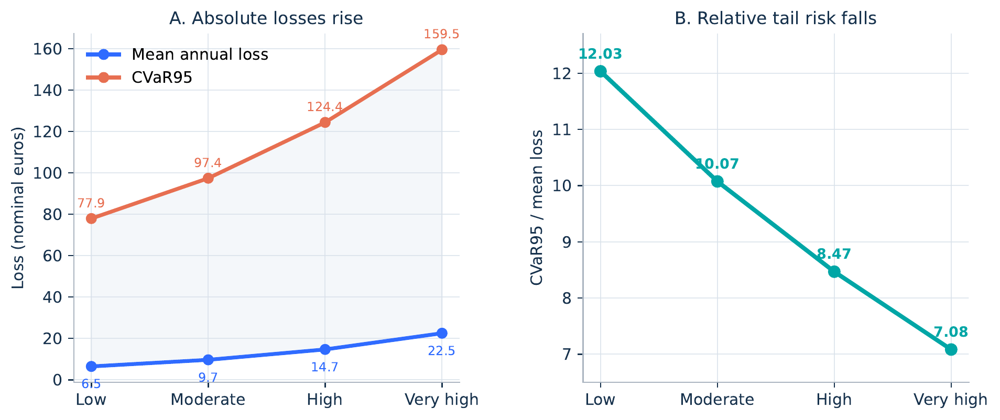
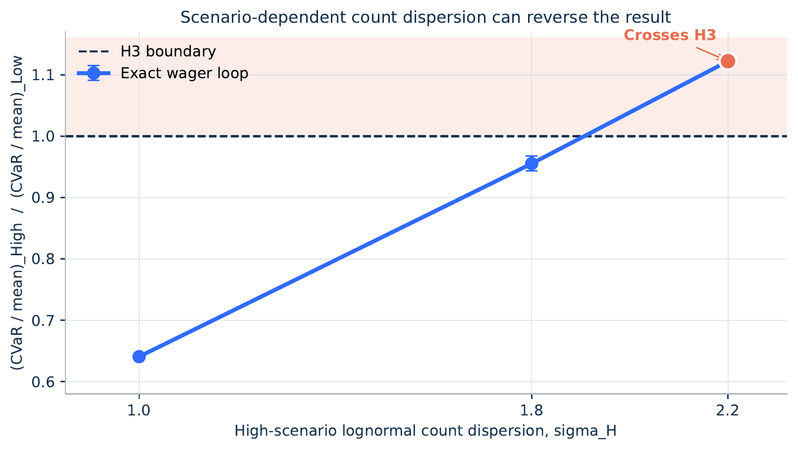

> **In short.** In my baseline model, moving from the Low to the Very-high behavioral scenario raised mean annual loss by $3.48\times$ and the average loss in the worst 5% of simulated years by $2.05\times$. Absolute harm increased, but tail loss grew *less* than proportionally to the mean. A convex-order argument explains why this must happen in a restricted frequency-only model. Allowing bet-count dispersion to change by scenario can reverse the result mathematically, but every tested crossing specification pushes either the mean or the median count outside a plausible empirical range.

## A question left over from M3

Following the 2026 Mathworks Modeling Challenge, a mathematics competition that incorporates both mathematical modeling and technical computing, I became more invested in the effects of gambling on individuals. During the competition, the central question – “Should society be concerned about online gambling and its continued growth?” – was broken down into three main parts: estimating disposable income, evaluating risk from demographics, and quantifying these predictions. Given that we only had 14 hours, there seemed to be so much more territory worth exploring post-comp.

Harboring lingering thoughts towards the idea, I never looked back until my English teacher introduced an assignment called the [I-Search Essay](/posts/2026-03-25-impulsivity-isearch/), in which students get to pick a problem that means something to them. Immediately, I thought about the prevalence of “gambling” streams on the internet, particularly on social media platforms, where algorithms dominate and manipulate users’ interests. It seemed like everyone was gambling, whether it was on their health (peptide craze), sports, and even on non-trivial things like the weather. Prediction markets took the internet by storm, causing me to try and understand the effects of digital overstimulation on individuals, particularly adolescents.

As technology develops, social media’s grip on our lives, especially scrolling algorithms, only increases. With that, prediction markets and other forms of gambling quickly rose in popularity, and waves of advertisements soon followed. The key variable involved in all these choices, which was what I discovered, was impatience. We can use:
 Hyperbolic discounting describes the present value of a delayed reward as

$$
V(D)=\frac{A}{1+kD},
$$

where a larger $k$ denotes steeper discounting of delayed rewards. The functional form follows [Mazur (1987)](https://doi.org/10.4324/9781315825502-4); [Green and Myerson (2004)](https://doi.org/10.1037/0033-2909.130.5.769) provide a review. Objectively logged smartphone use has been correlated with delay discounting, although the evidence is correlational rather than causal ([Schulz van Endert and Mohr, 2020](https://doi.org/10.1371/journal.pone.0241383)). This analysis examines a conditional pathway: whether raising gambling frequency and the probability of post-loss stake escalation, as impatience increases, changes annual losses.

An important qualification applies at the outset: the parameter $k$ performs no computational role in the model. An ordinal severity index $z\in\{0,1,2,3\}$ is used instead to assign assumed values of bet frequency and post-loss escalation; renaming $z$ would change nothing. The model therefore captures the conditional consequences of behavioral intensification, not an estimated causal model of hyperbolic discounting.

## The model

The four scenarios use annual bet counts

$$
N(z)=\operatorname{round}(23\cdot1.5^z)=\{23,34,52,78\}
$$

and probabilities that a loss triggers an elevated next stake of

$$
p_C(z)=\{0.050,0.095,0.174,0.296\}.
$$

The escalation probabilities follow an odds-doubling rule,

$$
\operatorname{odds}(z)=\frac{1}{19}\,2^z,
\qquad
p_C(z)=\frac{\operatorname{odds}(z)}{1+\operatorname{odds}(z)}.
$$

Every bettor-year begins in the Normal state. A loss makes the *next* wager Elevated with probability $p_C(z)$; a win or a loss that does not trigger escalation makes the next wager Normal. Thus an Elevated state can continue only when each preceding wager loses and independently triggers another escalation.

Normal stakes are independent gamma draws with shape 2 and mean 6.10 euros, a scale anchor set equal to the *median* stake reported by [Nelson et al. (2021)](https://doi.org/10.1556/2006.2021.00029), not their reported mean; Elevated stakes use the same shape and a mean $1.25\times$ as large. The 25% increase is only a plausibility anchor: [Zhang et al. (2024)](https://doi.org/10.1038/s41598-024-70738-3) estimated a 24.58% immediate next-bet response to a one-standard-deviation increase in the prior loss in slot-machine play, not sports betting. Each wager wins with probability $0.5$; a win earns $10/11$ of the stake and a loss forfeits it, for a house edge of $1/22$. The account data motivate scale only; every change across $z$ is assumed.

The homogeneous baseline has no bettor-level multiplier $S$; $S$ is introduced later only as an optional heterogeneity extension for the theorem and sensitivity sweep. Headline results use an unlimited bankroll, and the random-count experiment is uncapped.

Three claims are distinguished:

- **H1:** mean annual loss rises;
- **H2:** absolute tail loss and fixed-threshold exceedance probabilities rise; and
- **H3:** tail loss rises *faster proportionally* than mean loss.

H3 can be written as

<p>
$$
\frac{\mathrm{CVaR}_{95,H}}{\mathrm{CVaR}_{95,L}}
>
\frac{\mathbb{E}[L_H]}{\mathbb{E}[L_L]},
$$
</p>

where $\mathrm{CVaR}_{95}$ is the average loss among the worst 5% of simulated years.

## The model rejected the strongest hypothesis

The baseline simulation drew 200,000 bettor-years per scenario. Mean loss rose from 6.48 to 22.52, while $\mathrm{CVaR}_{95}$ rose from 77.94 to 159.51. H1 and the absolute-CVaR part of H2 held. H3 did not: the mean rose $3.48\times$, compared with only $2.05\times$ for CVaR. Equivalently, $\mathrm{CVaR}_{95}/\mathbb{E}[L]$ fell from 12.03 to 7.08. Across twenty independent batches of 10,000 paths, the 95% Monte Carlo intervals were $[6.33,6.62]$ and $[22.26,22.79]$ for the Low and Very-high means, and $[77.58,78.26]$ and $[158.77,160.19]$ for their CVaRs. These intervals measure simulation precision, not uncertainty in the behavioral assumptions.



This negative relative-tail result did not mean that harm disappeared. For fixed absolute-loss thresholds of 25, 50, and 100 euros, the Very-high to Low exceedance ratios were 1.64, 3.25, and 34.35. The thresholds are not validated measures of financial distress: 25 euros happens to equal the median net loss reported by Nelson et al., while 50 and 100 are round-number diagnostics. The point is distributional. Translating a loss distribution to the right can create a large jump past any fixed threshold even while its dispersion relative to the mean falls.

That distinction kept the model tied to gambling rather than turning it into an exercise in variance arithmetic. Relative tail shape and absolute exposure answer different questions. A household can face a much larger chance of crossing a consequential loss level even when normalized CVaR declines.

A separate 100,000-path stylized bankroll sensitivity used its own common-random-number run. Its unlimited-bankroll relative-tail ratio was 0.584, rather than the headline run's 0.589; at the tightest starting bankroll—$25\times$ the mean stake, or about 152.50 euros—it fell to 0.563, and 4.16% of Very-high paths exhausted the bankroll. The floor truncated the Very-high arm's tail more strongly, so finite bankroll made H3 harder to satisfy, not easier.

## A small effect hidden by simulation noise

Before interpreting the decomposition, it was necessary to establish whether post-loss escalation contributed any effect at all. In a 500,000-path-per-case common-random-number decomposition, holding escalation at its Low value and increasing annual bets from 23 to 78 moved mean loss from 6.43 to 21.88 and CVaR from 78.08 to 153.24. Changing escalation alone at $N=23$ moved mean loss only to 6.62 and CVaR to 81.24—an effect of about 3.0% in simulation and 2.93% analytically. Rising frequency therefore accounts for almost all of the baseline change.

An early version used independent random seeds for the Low and High scenarios, making a small channel effect difficult to separate from Monte Carlo noise.

Common random numbers (CRN) were adopted instead: Low and High scenarios reuse matched underlying random draws, so the comparison removes much of the variation shared by both. The decomposition implements that pairing by passing the same `common_seed` to every case:

```python
# impatience_simulation.py, lines 306–327
def decomposition(
    spec: ModelSpec, scenarios: list[Scenario], n_paths: int = 500_000
) -> pd.DataFrame:
    """Separate frequency and post-loss-response channels."""
    low, high = scenarios[0], scenarios[-1]
    cases = {
        "Low reference": low,
        "Frequency only": Scenario(
            "Frequency only", high.x, high.bets, low.p_chase
        ),
        "Escalation only": Scenario(
            "Escalation only", high.x, low.bets, high.p_chase
        ),
        "Combined": high,
    }
    rows = []
    common_seed = SEED + 500_000
    for name, s in cases.items():
        losses = simulate_paths(spec, s, n_paths, common_seed)
        rows.append(
            {
                "case": name,
                "bets": s.bets,
                "p_chase": s.p_chase,
                **summarize(losses),
            }
        )
    table = pd.DataFrame(rows)
    table.to_csv(OUT / "decomposition.csv", index=False)
    return table
```

In a separate Very-high-frequency diagnostic with $N=78$, turning elevation on ($c:1.00\rightarrow1.25$) increased mean loss by 3.64%, against 3.66% analytically. CRN reduced the variance of that paired estimate by about $223\times$, equivalent to a $\sqrt{223}\approx14.9\times$ reduction in standard error. This 3.64% diagnostic is not the same comparison as the approximately 3.0% escalation-only decomposition at $N=23$. CRN did not make either effect larger; it made a small effect measurable.

## From $1/\sqrt{N}$ intuition to a theorem {#from-1-sqrt-n-intuition-to-a-theorem}

Suppose per-bet losses $Y_1,\ldots,Y_N$ are independent and identically distributed, with positive mean $\mu$ and variance $\sigma^2$. Total loss has mean $N\mu$ and standard deviation $\sqrt{N}\sigma$. Relative dispersion is therefore

$$
\frac{\operatorname{SD}\left(\sum_{t=1}^N Y_t\right)}{\mathbb{E}\left[\sum_{t=1}^N Y_t\right]}
=\frac{\sigma}{\mu\sqrt{N}}.
$$

More bets raise expected loss linearly while diversifying per-bet outcome noise at the familiar $1/\sqrt{N}$ rate. This is the Gaussian intuition behind the figure above.

A 162-design sensitivity sweep supported that mechanism numerically. The stake distribution, escalation size, frequency growth, escalation-odds growth, and between-bettor stake heterogeneity were each varied. Each design used 30,000 paths per arm with common random numbers; all point estimates remained below one, with a maximum relative-tail ratio of 0.839. In 81 designs, a bettor-level stake scale $S$ was added: lognormal with median 6.10 euros, truncated at Nelson et al.'s observed maximum of 1,930.87 euros, with $\sigma=1.484$ calibrated so that the truncated mean equaled the reported 18.30 euros. H3 held in none of the 162 designs. These were not, however, 162 independent confirmations: frequency growth alone explained 92.18% of the variation in the relative-tail ratio, and the correlation between that ratio and $1/\sqrt{N_H/N_L}$ was 0.9728. Most rows restate the same averaging effect.

The theorem is stronger than the Gaussian story, but narrower than the full simulation. Let $Y_t$ be i.i.d. per-bet losses with $0<\mu=\mathbb{E}[Y_t]<\infty$. For this extension only, let $S\ge0$ be an integrable bettor-level stake scale, independent of every $Y_t$, and define

$$
L_N=S\sum_{t=1}^N Y_t.
$$

Then, whenever the relevant CVaR is finite,

$$
R_N=\frac{\mathrm{CVaR}_\alpha(L_N)}{\mathbb{E}[L_N]}
\quad\text{is nonincreasing in } N.
$$

The proof is short. The sample means $\bar{Y}_N=N^{-1}\sum_{t=1}^N Y_t$ decrease in convex order as $N$ increases. If $X\preceq_{cx}Z$, multiplying both by the same independent nonnegative $S$ preserves that ordering: condition on $S=s$ and observe that $x\mapsto\phi(sx)$ remains convex for every convex $\phi$. CVaR respects convex order because it is a law-invariant coherent risk measure, and it is positively homogeneous. Homogeneity gives

$$
R_N
=\mathrm{CVaR}_\alpha\!\left(\frac{L_N}{\mathbb{E}[L_N]}\right)
=\mathrm{CVaR}_\alpha\!\left(\frac{S\bar{Y}_N}{\mathbb{E}[S]\mu}\right),
$$

and convex-order monotonicity then gives $R_{N+1}\le R_N$.
This upgrades the simulation-based finding to a structural result for the frequency-only i.i.d. submodel, even with scenario-invariant independent stake heterogeneity. It does *not* prove the result for the full two-state process, where post-loss escalation makes wagers state-dependent and changes across scenarios. That extension remains numerical.

## Breaking the theorem — and checking what broke

The proposition also suggests where to look for a counterexample: alter the normalized loss distribution itself. Fixed bet counts were replaced with rounded lognormal counts, whose locations preserved the same scenario means, 23 and 78, while their dispersion parameters were allowed to differ. An exact C++ wager loop was used because, at $\sigma_H=2.2$, the rare paths with enormous uncapped counts are precisely the paths that drive CVaR; a normal approximation or an arbitrary loop cap can erase the effect under study.

```cpp
// random_count_exact.cpp, lines 77–108 (inside simulate)
for (std::size_t i = 0; i < paths; ++i) {
  std::uint64_t n;
  if (sigma_count == 0.0) {
    n = static_cast<std::uint64_t>(std::llround(target_count));
  } else {
    double raw = std::exp(mu_count + sigma_count * normal(rng));
    n = std::max<std::uint64_t>(1, std::llround(raw));
    n = std::min(n, count_cap);
  }
  count_sum += n;
  count_sum_sq += static_cast<long double>(n) * n;
  count_max = std::max(count_max, n);

  bool elevated = false;
  double net = 0.0;
  for (std::uint64_t t = 0; t < n; ++t) {
    double stake = elevated ? elevated_stake(rng) : normal_stake(rng);
    bool win = uniform(rng) < q_win;
    net += win ? payout_multiple * stake : -stake;
    elevated = (!win) && (uniform(rng) < p_chase);
  }
  losses.push_back(-net);
}

long double loss_sum =
    std::accumulate(losses.begin(), losses.end(), 0.0L);
double mean = static_cast<double>(loss_sum / paths);
std::sort(losses.begin(), losses.end());
std::size_t tail_start = static_cast<std::size_t>(std::floor(0.95 * paths));
long double tail_sum = std::accumulate(
    losses.begin() + tail_start, losses.end(), 0.0L);
double cvar95 = static_cast<double>(tail_sum / (paths - tail_start));
```

*The complete source first calibrates $\mu$ by bisection so that rounding produces the target mean count. `count_cap` is a sentinel set orders of magnitude above any realized draw in the reported experiment, so it never actively constrains `n`; the 5,000-count cap discussed below belonged only to the separate review harness. This excerpt therefore runs every realized wager and computes CVaR from the exact upper 5% by rank.*

With equal dispersion $\sigma_L=\sigma_H=1.0$, the eight-run mean relative-tail ratio was 0.644, compared with 0.589 under fixed counts. Holding $\sigma_L=1.0$ and increasing $\sigma_H$ to 1.8 raised it to 0.967. At $\sigma_H=2.2$, it crossed the H3 boundary at 1.117. A second crossing specification, $(\sigma_L,\sigma_H)=(0.5,2.0)$, reached 1.222. Eight independent exact wager-loop replications of 200,000 paths per arm confirmed the two crossings.



Mathematically, this is a valid existence result: scenario-dependent count dispersion can overpower frequency diversification. Empirically, it created a new problem. For a lognormal variable,

$$
\operatorname{median}(N)=\operatorname{mean}(N)e^{-\sigma^2/2}.
$$

Preserving a High-scenario mean of 78 at $\sigma_H=2.2$ implies a median of only 6.9 bets. The typical High-scenario bettor then bets about half as often as the mean-preserved Low bettor, whose implied median is 14.0. The behavioral premise is inverted at the median.

Preserving the median instead does not remove the crossing. Uncapped reruns gave relative-tail ratios near 1.15 at $(1.0,2.2)$ and 1.08 at $(0.5,2.0)$. But the implausibility moves into the mean:

$$
\mathbb{E}[N]=\operatorname{median}(N)e^{\sigma^2/2}.
$$

A preserved High-scenario median of 78 implies mean annual counts of 394, 576, and 877 at $\sigma_H=1.8, 2.0,$ and $2.2$. Nelson et al. reported a pooled mean of 92.8 bets over eight months, about 139 when mechanically annualized. The crossing cases require four to six times that annualized mean.


The pooled account data show substantial heterogeneity. Direct inspection of [Nelson et al.'s Table 2](https://doi.org/10.1556/2006.2021.00029) shows that, over the pooled eight-month window, bet count had mean 92.80, SD 374.12, and median 15; median net loss was 25 euros. The count mean and SD imply a moment-matched lognormal $\sigma\approx1.69$. In the explicit equal-dispersion $(1.69,1.69)$ configuration, the eight-run mean relative-tail ratio was 0.733, not a crossing. More importantly, pooled dispersion says nothing about whether dispersion widens with impatience: the counterexample remains mathematically live and empirically unverified.

One debugging episode sharpened this conclusion. During revision, an AI review pass reported that a median-preserved rerun erased the crossing. A second AI-assisted check could not reproduce that result and instead reproduced the crossing. That disagreement prompted an inspection of both test harnesses: the first review harness, not the research package, capped annual counts at 5,000. At $\sigma_H=2.2$, the cap removed precisely the rare high-count paths that drive CVaR. An uncapped rerun restored the crossing. The disagreement did not rescue the empirical case; it replaced a false objection with the more precise moment-squeeze objection.

## What survived

The original intuition was partly right. Under the assumed scenarios, greater behavioral intensity raises mean loss, absolute CVaR, and the chance of passing fixed absolute-loss thresholds. But greater frequency alone can reduce tail loss *relative to the mean* because repeated wagers average away outcome noise. In the restricted i.i.d. model, convex order makes that statement exact.

H3 is still reachable in principle. Within the tested lognormal-count family, however, every specification that crossed H3 forced either typical betting activity or mean betting activity outside the empirically plausible range. Preserving one moment merely moved the problem into another.

The model's scale also limits the conclusion. The Very-high scenario uses 78 bets per year and mean loss of 22.52 euros, below Nelson's pooled mean activity over only eight months and near its reported median net loss of 25 euros. This simulation does not represent the severe household-harm cases discussed in broader gambling research such as [Baker et al. (2026)](https://www.sciencedirect.com/science/article/abs/pii/S0304405X26001017). It studies a distributional mechanism among conditional bettors, not bankruptcy or population-level welfare.

The next empirical question is narrower than the one that motivated this analysis: does measured impatience predict not only the average level of betting activity, but also its dispersion? Until linked data measure both, the most defensible conclusion is a boundary statement: scenario-dependent count dispersion can reverse normalized tail risk mathematically, but the tested reversals do not yet pass a joint mean-and-median reality check.

> **Reproducibility.** The numerical claims in this post trace to a Python baseline/robustness simulation and an exact C++ random-count experiment. Source excerpts with line-number citations from both files are shown in the [code walkthrough](/posts/tail-risk-code/). Monte Carlo precision does not substitute for uncertainty about the behavioral assumptions.
>
## Conclusion

Under the assumptions of this model, greater betting activity raises harm in the most direct sense. People in the Very-high scenario lose more money on average, lose more in the worst 5% of simulated years, and are much more likely to cross fixed loss thresholds such as €50 or €100. The model does not find that more betting becomes safe or less damaging.

The less intuitive result concerns *relative* risk. Average loss rose by \(3.48\times\), while the average loss in the worst 5% of years rose by \(2.05\times\). Bad years therefore became more expensive in euros, but they became less extreme compared with the new, higher average. In other words, the distribution shifted toward larger losses while becoming less spread out relative to its center.

The reason is similar to the difference between flipping a coin 5 times and flipping it 100 times. With only 5 flips, a short streak can dominate the result: getting 4 heads feels unusually high. With 100 flips, streaks still occur, but they matter less relative to the total number of flips. The final proportion usually sits closer to 50%. In this model, each additional wager adds expected loss because the game has a house edge. At the same time, more wagers give random wins and losses more opportunities to offset one another. The house edge becomes clearer, while luck makes up a smaller share of the total outcome.

That is why “smoother” should not be confused with “better.” A bettor who places more wagers may experience annual losses that are more predictable relative to their average loss, but that average loss is also much larger. The model’s post-loss escalation rule adds some harm, yet most of the increase comes from frequency itself.

The convex-order result shows that this pattern is not just an accident of one simulation. In the restricted model of independent bets with a fixed distribution of betting scale, normalized tail risk cannot rise as the number of bets rises. The fuller simulation is more complicated, but it follows the same pattern across the tested assumptions.

The counterexample shows the boundary of that result. Relative tail risk can rise if a high-activity scenario also has far more unequal bet counts, with a small number of people placing extraordinarily many wagers. In the tested lognormal cases, however, making that reversal occur required an implausible tradeoff: either the typical high-activity bettor placed fewer bets than the typical low-activity bettor, or the mean high-activity count became far above the available data.

This does not establish that impatience causes gambling losses, nor does it describe every form of gambling harm. It shows a narrower point: when betting frequency rises, absolute losses can become much worse even as the worst outcomes grow less extreme relative to the mean. To understand whether real behavioral differences reverse that pattern, the next step is data that link measured impatience to both the average *and the spread* of gambling activity.

## References

1. Mazur, J. E. (1987). [An adjusting procedure for studying delayed reinforcement.](https://doi.org/10.4324/9781315825502-4) In M. L. Commons, J. E. Mazur, J. A. Nevin, & H. Rachlin (Eds.), *Quantitative Analyses of Behavior, Vol. 5: The Effect of Delay and of Intervening Events on Reinforcement Value*, 55–73. Erlbaum.
2. Green, L., & Myerson, J. (2004). [A discounting framework for choice with delayed and probabilistic rewards.](https://doi.org/10.1037/0033-2909.130.5.769) *Psychological Bulletin*, 130(5), 769–792.
3. Schulz van Endert, T., & Mohr, P. N. C. (2020). [Likes and impulsivity: Investigating the relationship between actual smartphone use and delay discounting.](https://doi.org/10.1371/journal.pone.0241383) *PLOS ONE*, 15(11), e0241383.
4. Nelson, S. E., Edson, T. C., Louderback, E. R., Tom, M. A., Grossman, A., & LaPlante, D. A. (2021). [Changes to the playing field: A contemporary study of actual European online sports betting.](https://doi.org/10.1556/2006.2021.00029) *Journal of Behavioral Addictions*, 10(3), 396–411.
5. Zhang, K., Rights, J. D., Deng, X., Lesch, T., & Clark, L. (2024). [Within-session chasing of losses and wins in an online eCasino.](https://doi.org/10.1038/s41598-024-70738-3) *Scientific Reports*, 14, 20353.
6. Baker, S. R., Balthrop, J., Johnson, M. J., Kotter, J. D., & Pisciotta, K. (2026). [Gambling away stability: Sports betting's impact on vulnerable households.](https://www.sciencedirect.com/science/article/abs/pii/S0304405X26001017) *Journal of Financial Economics*. Earlier version: [NBER Working Paper No. 33108](https://www.nber.org/papers/w33108), 2024