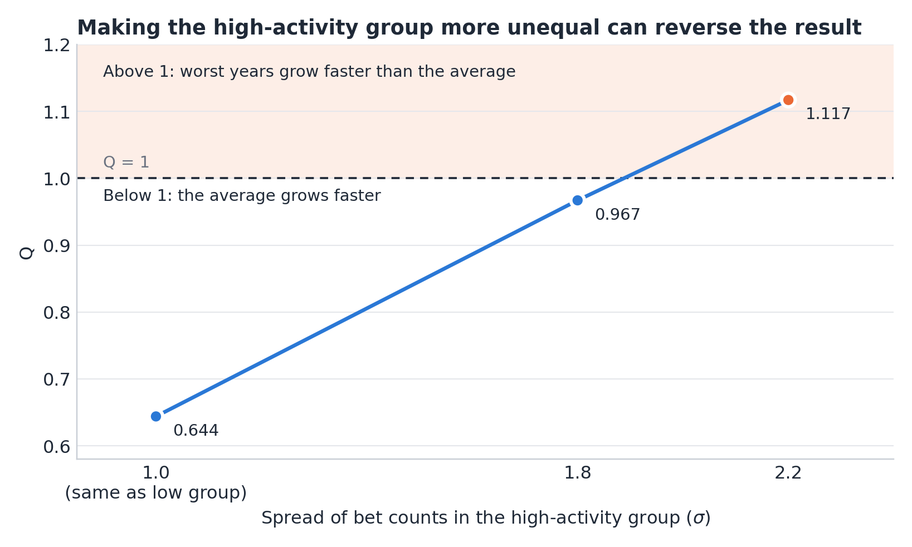
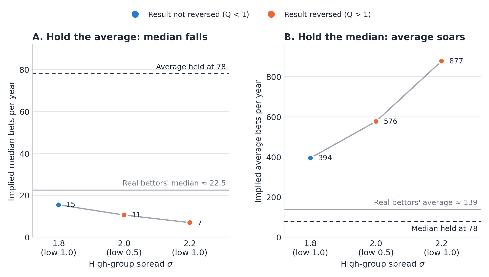

> **Computational disclosure:** AI tools assisted with computational work and checks of the analysis.

## Executive Summary

In the 2026 MathWorks Math Modeling Challenge (M3), our team modeled the financial consequences of online sports gambling through disposable income, annual gambling losses, and the significance of those losses [1]. One limitation we identified was that risk tolerance was treated as static: *"We do not model escalation over time; a dynamic model would likely show compounding harm."* This follow-up tests that expectation directly.

**Model.** We simulate a simplified gambler who places −110-style straight bets (50% win probability, profit of $10/11$ of the stake on a win). Four scenarios increase both the number of bets per year (23 to 78) and the probability that a loss triggers a 25% larger next stake (5.0% to 29.6%). Each scenario is simulated for 200,000 years.

**Key finding: absolute harm increases.** Mean annual loss rises from €6.48 to €22.52, and the average loss in the worst 5% of years (CVaR95) rises from €77.94 to €159.51. The probability of losing more than €100 in a year becomes about 34 times as large.

**Critically, the relative tail shrinks.** Mean loss grows by a factor of 3.48, while CVaR95 grows by only 2.05, giving a tail-to-mean growth ratio of $Q = 0.589$. Bad years become more expensive in euros but smaller relative to the average. We explain this through an averaging mechanism and prove the result for a simpler independent-bet model using convex order.

**Boundary.** When the high-activity group's annual bet counts become sufficiently unequal across people, the result reverses ($Q$ up to 1.222). This reversal requires an extremely active minority, and current evidence does not establish whether more impatient gamblers actually form such a population.

**Bottom line.** Within the tested model, more frequent betting and post-loss escalation produce more monetary harm, but not a disproportionately heavier tail. "Compounding harm" must therefore be tied to a defined outcome: larger average losses, more costly bad years, and a larger relative tail are distinct claims.

## 1 Introduction

### 1.1 Background

In the M3 Challenge, our team investigated online sports gambling through three connected models: disposable income (Q1), annual gambling gains and losses (Q2), and the significance of those losses relative to a person's financial resources (Q3) [1]. The competition's 14-hour limit required simplifying assumptions about both financial circumstances and betting behavior.

Section 7.2 of our paper listed the following weakness:

> "Static risk tolerance: We do not model escalation over time; a dynamic model would likely show compounding harm."

That statement suggested a direction for further work, but it also contained an untested expectation. If a bettor increases activity or raises the next stake after losing, how much worse do outcomes become? In particular, do the worst years become disproportionately worse than the average year?

A related pattern appears in competitive chess as *tilt*: frustration after a loss leads a player to keep playing in an attempt to recover rating points. Financial gambling has different consequences, but the comparison motivates the focus on decisions made after a loss. An immediate attempt to recover may change both the number of decisions and the amount committed to each one.

This paper addresses that question using a separate, simplified gambling model. It extends the original research question rather than continuing the full demographic and disposable-income framework of [1]. The temporary post-loss stake increase considered here also does not represent every possible form of escalation.

### 1.2 Behavioral Motivation: Delay Discounting

The preference for recovering a loss immediately connects to **delay discounting**, which describes how waiting changes the value a person places on a reward. Someone who prefers €10 now to €15 next week values immediacy enough to give up the additional €5. A common mathematical description is **hyperbolic discounting** [2, 3]:

$$
V(D)=\frac{A}{1+kD}, \tag{1}
$$

where $A$ is the amount offered, $D$ is the delay, $V(D)$ is the present subjective value, and $k$ controls how strongly delay reduces that value. For a €15 reward delayed one week, $k=0.2$ per week gives a present value of €12.50, while $k=1$ per week gives €7.50. In the second case, an immediate €10 is more attractive than the delayed €15.

Equation (1) is a model of subjective valuation, not a claim that waiting removes money from the reward. Schulz van Endert and Mohr [4] also found an association between recorded smartphone use and delay discounting; that association does not establish a direction of causation.

This literature motivates examining whether a preference for immediate rewards could be associated with greater betting activity, with a post-loss stake increase as a second mechanism. However, **the simulation does not measure impatience or use $k$ as an input.** It compares assumed levels of betting activity.

### 1.3 Research Predictions

We test three predictions:

1. **P1.** Mean annual losses increase with betting activity.
2. **P2.** Worst-year losses and the probabilities of exceeding selected loss thresholds increase.
3. **P3.** Worst-year losses increase proportionally faster than mean losses.

P3 is the main focus. An increase in average loss is expected in an unfavorable game, but it does not establish how the worst outcomes change relative to that average.

## 2 Model Development

### 2.1 Problem Restatement

We predict how an individual's annual net gambling loss changes when they bet more often and become more likely to raise their next stake after a loss. Specifically: **if people bet more often and become more likely to increase their next stake after a loss, what happens to the mean and the worst tail of their annual losses?**

### 2.2 Assumptions

- **A1. Bet mechanics:** Each wager has an independent 50% chance of winning. A win returns the stake plus a net profit of $10/11$ of the stake; a loss forfeits the stake. *Justification:* This is a standard −110 straight bet, the same bet type used in our M3 model (Table 5 of [1]), with an implied house edge of about 4.55%.
- **A2. Independence of outcomes:** The win probability does not change after winning or losing streaks. *Justification:* Sports outcomes do not respond to a bettor's history; only the bettor's stake can.
- **A3. Stake distribution:** Normal stakes follow a gamma distribution with shape 2 and mean €6.10. Elevated stakes follow the same shape with mean €7.625 (25% higher). *Justification:* €6.10 is the median of bettor-level average bet sizes reported by Nelson et al. [5]; the gamma family generates positive amounts with many modest values and some larger ones.
- **A4. Escalation rule:** A loss followed by a random trigger makes only the next stake elevated. The model never multiplies the previous stake repeatedly and does not track a cumulative recovery target. *Justification:* The 25% response is loosely motivated by evidence of within-session chasing [6]; a temporary rule isolates a limited post-loss response.
- **A5. Fixed annual count:** In the baseline, everyone in a scenario makes the same number of bets. This assumption is relaxed in Section 8.
- **A6. No bankroll constraint:** In the baseline, bettors complete all scheduled bets regardless of accumulated losses. A bankroll restriction is tested in Section 4.4.
- **A7. Activity is not measured impatience:** The scenario index is a label for assumed behavioral intensity. *Justification:* No data linking measured impatience to betting records were available; the relationship in Section 2.4 is an experimental design, not an estimate.

### 2.3 Bet Mechanics and Expected Loss

For a stake of $s$ euros, half the outcomes lose $s$ and half earn $10s/11$. The expected loss per wager is

$$
\frac12 s-\frac12\left(\frac{10}{11}s\right)=\frac{s}{22}. \tag{2}
$$

For an €11 stake, the expected loss is €0.50; for a €6.10 stake, approximately €0.28. "Expected" denotes the probability-weighted average across outcomes, not a guaranteed charge on the next bet. We measure **annual net loss** $L$: money lost on losing bets minus profit from winning bets. Negative values indicate that the bettor finished the year ahead.

Equation (2) establishes why additional betting increases mean loss. It leaves open the main question: whether losses in the worst years increase faster proportionally.

### 2.4 Frequency and Escalation Parameters

Let $z \in \{0,1,2,3\}$ index the scenarios. Annual bet counts follow

$$
N(z)=\operatorname{round}(23\cdot1.5^z), \tag{3}
$$

so each step increases the unrounded count by 50% (the implementation rounds 34.5 to 34). Escalation probabilities are obtained by doubling the **odds** at each step:

$$
\operatorname{odds}(z)=\frac{2^z}{19},
\qquad
p_C(z)=\frac{\operatorname{odds}(z)}{1+\operatorname{odds}(z)}. \tag{4}
$$

Odds of 1 to 19 correspond to a probability of $1/(1+19)=5\%$; doubling odds does not exactly double probability.

**Table 1:** Baseline scenario parameters

| Scenario | Index $z$ | Bets per year $N$ | P(loss triggers elevated next stake) $p_C$ |
|---|---:|---:|---:|
| Low | 0 | 23 | 5.0% |
| Medium | 1 | 34 | 9.5% |
| High | 2 | 52 | 17.4% |
| Very high | 3 | 78 | 29.6% |

"Very high" is a label within this experiment. Seventy-eight bets per year should not be interpreted as a clinical category or a definition of problem gambling.

### 2.5 Monte Carlo Simulation

For each scenario, we simulate 200,000 years. Every simulated year begins with a normal stake; after each bet, a loss combined with an escalation trigger makes the next stake elevated, and otherwise the next stake is normal. A **Monte Carlo simulation** repeats these random trials to estimate the distribution of annual outcomes. Each simulated year is one possible history generated by the model's rules, not an observation of a real person.

The empirical inputs inform selected parameters; the baseline is not calibrated to reproduce the full observed populations of [5] or [6].

## 3 Outcome Measures

### 3.1 Conditional Value at Risk

Mean annual loss does not indicate whether losses are concentrated in a few unusually bad years. A model in which nearly everyone loses €20 can have the same mean as one with many small gains and a few very large losses. We therefore also measure the upper end, or **tail**, of the loss distribution.

We use **conditional value at risk at 95%**, $\mathrm{CVaR}_{95}$, also called expected shortfall: the average loss among the worst 5% of simulated years. With 200,000 years, this is the average of the 10,000 largest annual losses. CVaR is neither the single worst year nor the 95th-percentile cutoff.

### 3.2 Tail-to-Mean Growth Ratio

To test P3, we compare proportional changes:

$$
Q=
\frac{\mathrm{CVaR}_{95,\mathrm{high}}/\mathrm{CVaR}_{95,\mathrm{low}}}
{\mathbb E[L_{\mathrm{high}}]/\mathbb E[L_{\mathrm{low}}]}. \tag{5}
$$

The numerator measures how many times larger worst-5% losses become; the denominator measures how many times larger mean losses become. If $Q>1$, the tail grows faster proportionally and P3 holds. If $Q<1$, the mean grows faster. This interpretation uses positive group mean losses, as in all reported comparisons.

## 4 Results

### 4.1 Baseline Results

**Table 2:** Baseline comparison of the lowest and highest activity scenarios (200,000 simulated years each)

| Measure | Low activity | Very-high activity | Growth multiple |
|---|---:|---:|---:|
| Bets per year | 23 | 78 | 3.39× |
| Mean annual net loss | €6.48 | €22.52 | 3.48× |
| CVaR95 (mean loss in worst 5% of years) | €77.94 | €159.51 | 2.05× |

$$
Q\approx\frac{2.05}{3.48}=0.589.
$$

P1 and P2 hold, but **P3 fails in the baseline.** Bad years become more expensive in euros, but their losses do not grow as quickly in percentage terms as the mean. Equivalently, CVaR95 is about 12 times the mean in the Low scenario (€77.94 vs. €6.48) but only about 7 times the mean in the Very-high scenario (€159.51 vs. €22.52).


*Figure 1: Baseline results. (Left) Mean annual loss and CVaR95 both rise with activity. (Right) CVaR95 as a multiple of mean loss falls from about 12 to about 7. Each scenario uses 200,000 simulated years.*

**Key observation.** Absolute loss measures euros lost; the relative-tail measure compares the worst-5% average with the group's own mean. A bad year can become more costly in euros while becoming a smaller multiple of a rising mean. A declining relative tail is therefore not a reduction in the monetary cost of bad years.

### 4.2 Fixed Loss Thresholds

**Table 3:** Probability of exceeding fixed annual loss thresholds, Very high relative to Low

| Annual net loss threshold | Probability ratio (Very high / Low) |
|---|---:|
| More than €25 | 1.64 |
| More than €50 | 3.25 |
| More than €100 | 34.35 |

These are **probability ratios**, not percentages of bettors. Exceeding €100 was about 34 times as likely in the Very-high scenario; this does not mean 34% of simulated years exceeded €100. A large ratio can arise from a small starting probability.

The €25 threshold was informed by the median net loss in Nelson et al. [5] over an **eight-month** observation period; here it serves as a fixed euro threshold for simulated annual losses, not an observed annual benchmark. The €50 and €100 thresholds are round-number comparisons. None is a universal definition of financial hardship. Rising threshold probabilities are consistent with a declining tail-to-mean ratio, because $Q$ measures proportional growth rather than the probability of exceeding a fixed amount.

### 4.3 Monte Carlo Uncertainty

To assess simulation noise, the 200,000 baseline years were divided into twenty batches of 10,000.

**Table 4:** 95% Monte Carlo intervals for baseline estimates

| Measure | Low | Very high |
|---|---:|---:|
| Mean annual loss | €6.33–€6.62 | €22.26–€22.79 |
| CVaR95 | €77.58–€78.26 | €158.77–€160.19 |

These intervals describe how precisely the computer estimates quantities **within the model**. They are not ranges containing 95% of individual gamblers' losses, and they do not establish that the model describes real behavior. More simulation improves precision without improving the realism of the assumptions.

### 4.4 Bankroll Restriction

A separate experiment relaxed Assumption A6 by introducing limited funds. With an initial bankroll of approximately €152.50 (25 times the mean normal stake), 4.16% of Very-high simulated years exhausted their funds. $Q$ declined from 0.584 without the restriction to 0.563 with it: limited funds constrained the highest losses more strongly in the higher-activity group.

This experiment used different random inputs from the baseline, which explains the slightly different unrestricted $Q$. It shows that the baseline finding persists under the tested restriction; it does not establish the effect of every possible borrowing, depositing, or stopping rule.

## 5 Decomposition of Frequency and Escalation

### 5.1 Results

The baseline changes two quantities simultaneously: the number of bets and the escalation probability. To separate their effects, we ran four cases with 500,000 simulated years each: the Low reference, a frequency-only change, an escalation-only change, and both together. The implementation is given in Appendix B.1.

**Table 5:** Decomposition of frequency and escalation effects

| Case | Bets per year | Escalation setting | Mean loss | CVaR95 |
|---|---:|---|---:|---:|
| Low reference | 23 | Low | €6.43 | €78.08 |
| Frequency only | 78 | Low | €21.88 | €153.24 |
| Escalation only | 23 | Very high | €6.62 | €81.24 |

Increasing frequency caused most of the increase in mean loss; increasing the escalation probability had a smaller positive effect. This comparison depends on the chosen rules: a temporary 25% elevation is a limited response, while the change from 23 to 78 bets is substantial. A more aggressive response to losses could produce a different comparison.

The decomposition used its own random draws, so its Low estimate (€6.43) differs slightly from the baseline (€6.48). The program also computes the combined case; the baseline values in Table 2 should not be substituted for that run's combined output.

### 5.2 Common Random Numbers

The escalation-only effect is small enough that simulation noise can obscure it. If each scenario receives an unrelated sequence of wins, losses, and stake draws, part of the estimated difference reflects different luck. We therefore used **common random numbers**: matched random inputs are reused across scenarios, so the effect of changing a rule is easier to distinguish from random variation. Each scenario's individual stake distributions and outcome probabilities remain those specified by the model.

### 5.3 Analytical Validation

For this model, if the normal stake mean is $m$, the elevated mean is $1.25m$, and the escalation probability after a loss is $p_C$, then

$$
\mathbb E[L_N]
=\frac{m}{22}\left[N+(N-1)\frac{p_C}{8}\right]. \tag{6}
$$

The first bet is normal. Every later bet is elevated with probability $p_C/2$, since the preceding bet must lose and trigger escalation. Multiplying by the 25% stake increase gives $p_C/8$, and the factor $1/22$ is the expected loss per euro staked from Equation (2).

**Table 6:** Simulation estimates compared with Equation (6)

| Comparison | Simulated increase in mean loss | Analytical increase |
|---|---:|---:|
| Escalation probability Low → Very high, at 23 bets | ≈ 3.0% | 2.93% |
| Elevated-stake multiplier 1.00 → 1.25, at 78 bets | 3.64% | 3.66% |

In the 78-bet diagnostic, matching random inputs reduced the variance of the estimated difference by a factor of approximately 223, corresponding to a standard error about $\sqrt{223}\approx14.9$ times smaller. The estimate became more precise; the underlying behavioral effect did not become larger.

## 6 Mathematical Explanation

### 6.1 The Averaging Effect

Consider four flips of a fair coin: three heads would make heads 75% of the outcomes, so a short streak can dominate a small sample. Across 1,000 flips, streaks still occur, but each accounts for a smaller share of the total. Repeated bets behave similarly. Random wins and losses have more opportunities to offset one another, while every additional bet contributes expected loss through the house edge.

This does not mean a bettor who has lost repeatedly is "due" to win; every next bet still has a 50% chance of winning (Assumption A2). The averaging describes the distribution of many possible sequences, not a mechanism that compensates someone for previous losses.

### 6.2 Mean and Standard-Deviation Scaling

Let $Y_t$ be the net loss on bet $t$, and suppose the per-bet losses are **independent and identically distributed** (iid) with mean $\mu>0$ and finite standard deviation $\sigma$. After $N$ bets,

$$
\mathbb E\left[\sum_{t=1}^{N}Y_t\right]=N\mu,
\qquad
\operatorname{SD}\left(\sum_{t=1}^{N}Y_t\right)=\sqrt N\,\sigma, \tag{7}
$$

so that

$$
\frac{\operatorname{SD}(\text{total loss})}
{\mathbb E[\text{total loss}]}
=\frac{\sigma}{\mu\sqrt N}. \tag{8}
$$

Four times as many bets gives four times the expected loss but only twice the standard deviation. Total losses become more spread out in euros while becoming less spread out **relative to their growing mean**. However, standard deviation describes overall variability, while CVaR focuses on the worst tail. A further argument is needed for CVaR itself.

### 6.3 Convex-Order Result for CVaR

To allow differences in betting scale, let $S$ be a nonnegative, dimensionless multiplier assigned to a bettor (for example, $S=2$ doubles every per-bet loss and profit). Define

$$
L_N=S\sum_{t=1}^{N}Y_t. \tag{9}
$$

Assume $S$ is independent of the per-bet outcomes, has the same distribution at every bet count compared, and has positive finite mean. Assume the iid per-bet losses are integrable with positive mean $\mu$, and that the relevant CVaR is finite. (The finite standard deviation used in Section 6.2 is not required.)

**Proposition.** Under these conditions, the ratio

$$
R_N=\frac{\mathrm{CVaR}_{\alpha}(L_N)}{\mathbb E[L_N]} \tag{10}
$$

cannot increase as $N$ increases: $R_{N+1}\le R_N$. At $\alpha=0.95$, this is the ratio of worst-5% average loss to mean loss.

*Sketch of proof.* The argument uses **convex order**, a comparison of equal-mean distributions: one distribution is less spread out when every convex penalty of its departures has no larger expected value. Averages of more iid observations decrease in this order; multiplying by the same independent nonnegative scale preserves the ordering; and CVaR respects it. Because CVaR scales proportionally under positive constants,

$$
R_N=
\mathrm{CVaR}_{\alpha}\left(
\frac{S\bar Y_N}{\mathbb E[S]\mu}
\right),
\qquad
\bar Y_N=\frac1N\sum_{t=1}^{N}Y_t, \tag{11}
$$

where the normalized loss inside CVaR has mean 1 for every $N$. The ordering then gives $R_{N+1}\le R_N$. The full averaging step is given in Appendix A. $\square$

In plain terms: **when only the number of iid bets increases, the worst-tail loss cannot become a larger multiple of mean loss.** The proposition covers a simpler model than the full simulation. In the simulation, a loss can change the next stake (Assumption A4), creating dependence between consecutive per-bet losses. The proposition explains the averaging mechanism; the simulation tests whether the pattern persists under the specified post-loss response.

## 7 Sensitivity Analysis

### 7.1 Parameter Sweep

A result from one simulation might depend on a particular setting. We therefore explored 162 combinations of assumptions, varying stake distributions, escalation sizes, frequency growth, escalation-odds growth, and differences in betting scale between people. Each design used 30,000 simulated years per comparison group.

**All 162 estimates of $Q$ remained below 1; the largest was 0.839.** The consistency supports the averaging explanation within the tested designs, although the designs are related and often preserve the same mechanism.

### 7.2 Heterogeneous Betting Scales

In 81 of the designs, bettors also differed in their typical stake size. Let $B$ denote a bettor's monetary stake scale in euros, with dimensionless multiplier $S=B/€6.10$. The scale followed a lognormal distribution with median €6.10 and an upper cutoff at €1,930.87; its dispersion parameter was tuned to approximately 1.484 so that the mean matched €18.30. These values were informed by the distribution of **bettor-level average bet sizes** in [5]; €1,930.87 was the largest bettor-level average in their table, not the largest individual wager. A **lognormal distribution** is a positive distribution whose logarithm is normally distributed, allowing many modest values and a few much larger ones.

Across the sweep, frequency growth accounted for 92.18% of the variation in $Q$. The correlation between $Q$ and the square-root averaging factor

$$
\frac{1}{\sqrt{N_{\mathrm{high}}/N_{\mathrm{low}}}}
$$

was 0.9728. These relationships support the averaging explanation of Section 6 within the chosen designs; their values depend on the sweep's parameter choices and do not establish that the model fits real gamblers.

## 8 Extension: Heterogeneous Annual Bet Counts

### 8.1 Problem Restatement

So far, everyone within a scenario has made the same number of bets (Assumption A5). Real populations contain occasional bettors and people who bet extremely frequently. Two processes then operate at once: within each person, repeated bets average out some of the influence of luck; across people, large differences in exposure create large differences in annual losses. We ask whether making the higher-activity group sufficiently unequal can produce $Q>1$.

### 8.2 Assumptions

- **B1. Random annual counts:** Each simulated year's bet count is drawn from a lognormal distribution, rounded to whole bets and kept at least 1. *Justification:* Observed betting counts are highly right-skewed [5].
- **B2. Count drawn in advance:** The count is drawn at the beginning of the year and is not a stopping decision made in response to wins and losses.
- **B3. Mean calibration:** The location parameter of the log-count distribution is calibrated by bisection so that the rounded counts reproduce the intended group mean (23 or 78).
- **B4. No effective cap:** A numerical safety cap is set above every count observed in the reported runs, so no sampled year is shortened. *Justification:* If the result depends on extremely high activity, truncating those years changes the model being studied (see Section 9.4).
- **B5. All other assumptions:** A1–A4 and A6 carry over unchanged.

The **dispersion parameter** $\sigma_{\mathrm{count}}$ controls how unequal the counts become. It measures spread in log counts and is distinct from the per-bet standard deviation $\sigma$ in Section 6. These experiments were implemented in C++ so that every sampled wager, including those in rare years with enormous counts, is executed exactly (Appendix B.2).

### 8.3 Results

**Table 7:** Tail-to-mean growth ratio under random annual counts (group means fixed at 23 and 78)

| Count pattern | Low-group dispersion | High-group dispersion | Reported $Q$ | P3 holds? |
|---|---:|---:|---:|---|
| Fixed counts, baseline | — | — | 0.589 | No |
| Equally dispersed random counts | 1.0 | 1.0 | 0.644 | No |
| Wider high-group counts | 1.0 | 1.8 | 0.967 | No |
| Still wider high-group counts | 1.0 | 2.2 | 1.117 | Yes |
| Alternative unequal-dispersion case | 0.5 | 2.0 | 1.222 | Yes |

Random-count entries are averages across eight independent runs of 200,000 simulated years per group. They summarize the tested settings rather than an exact universal boundary for reversal.



*Figure 2: $Q$ as the high-activity group's counts become more unequal, with the low-group dispersion held at 1.0 and group means at 23 and 78. The average $Q$ exceeds 1 at the widest high-group dispersion shown. Each random-count point averages eight runs of 200,000 years per group.*

**Key finding.** At the two unequal-dispersion settings with $Q>1$, worst-5% losses increased by a greater proportion than mean losses, so P3 can hold once the distribution of activity across people changes. This does not contradict the proposition of Section 6.3, which increases a fixed count $N$ while preserving all other distributional assumptions. Here, the groups have different random count distributions. Increasing average exposure and changing how that exposure is distributed across people are different operations.

## 9 Empirical Interpretation of the Reversal

### 9.1 Mean Versus Median Activity

A group can have a higher mean because most people bet more, or because a small minority bet much more. Consider ten people: nine make 10 bets each, and one makes 690. Their mean is 78 bets, but their **median** is only 10.

The same occurs in the lognormal experiments. For an underlying continuous lognormal count distribution,

$$
\operatorname{median}(N)
=\operatorname{mean}(N)\,e^{-\sigma_{\mathrm{count}}^2/2}. \tag{12}
$$

At high-group dispersion 2.2, preserving a mean of 78 implies a median of about 7, while the Low group (mean 23, dispersion 1.0) has a median of about 14. Thus "higher activity" describes the group mean, while the middle member of the high group actually bets less often. The reversal is driven by an unusually active minority. This does not show that such a group is mathematically inconsistent or empirically impossible.

### 9.2 Mean-Preserving and Median-Preserving Comparisons

If the high group's median is held at 78 instead of its mean, increasing dispersion pushes its mean much higher.

**Table 8:** Implied mean bet count when the high-group median is held at 78

| High-group dispersion | Approximate underlying mean |
|---|---:|
| 1.8 | 394 bets per year |
| 2.0 | 576 bets per year |
| 2.2 | 877 bets per year |



*Figure 3: (Left) Preserving a mean of 78 gives underlying medians of approximately 7–15 as dispersion increases. (Right) Preserving a median of 78 gives means of approximately 394–877. Orange points mark tested reversal settings. Gray reference lines use the eight-month pooled figures of [5] multiplied by 12/8 as a rough annual comparison.*

Preserving the median did not eliminate reversal: reruns without an effective cap produced $Q$ near 1.15 at dispersions $(1.0, 2.2)$ and near 1.08 at $(0.5, 2.0)$. The two controls answer different questions. Preserving the mean isolates a redistribution of activity at fixed average exposure; preserving the median keeps the middle person's activity fixed but allows average exposure to rise substantially. Neither is automatically the correct representation of real gamblers.

### 9.3 Comparison With Observed Betting Activity

Nelson et al. [5] report a pooled eight-month mean bet count of 92.80, standard deviation 374.12, and median 15. Multiplying the mean by $12/8$ gives approximately 139 bets as a rough annual comparison; this extrapolation assumes the observation period represents a longer one.

The median-preserving reversal groups have higher means than that pooled benchmark. However, a high-activity subgroup can legitimately exceed the population average: the same study reports a mean of approximately 1,846 bets over eight months for its most involved subgroup by count. A pooled average therefore cannot serve as a ceiling on plausible subgroup activity. This does not validate the reversal scenarios as models of impatience.

Matching a lognormal distribution to the pooled mean and standard deviation gives a count dispersion of approximately 1.69. Giving both groups that dispersion produced $Q=0.733$, with no reversal. Fitting two summary statistics does not guarantee a fit to the full observed distribution.

The missing evidence concerns **conditional differences**: how the distribution of betting activity changes among people with different measured levels of impatience. The pooled data describe overall variation but do not identify the link assumed in the model or establish the unequal group dispersions used in the reversals. **The tested reversals are possible within the model, while their relevance to differences in impatience remains unvalidated.**

### 9.4 Sensitivity to a Count Cap

During revision, an AI-assisted review implemented its own version of the median-preserving experiment and reported that the reversal disappeared; a second check found it again. Comparing the programs revealed the cause: the review program, not the research code, stopped counting at 5,000 bets per year. That limit removed part of the extreme activity responsible for the result, and removing it restored the reversal.

A cap can be a legitimate modeling assumption if it represents a real restriction, but adding one changes the question. When rare paths drive a tail statistic, a seemingly practical computational shortcut can alter the substantive conclusion. This motivated Assumption B4.

## 10 Strengths and Weaknesses

### 10.1 Strengths

1. **Analytical validation:** Simulated mean-loss changes match the closed-form Equation (6) to within a few hundredths of a percentage point (Table 6).
2. **Proof alongside simulation:** The central averaging mechanism is established by a convex-order argument rather than inferred only from numerical tests.
3. **Variance reduction:** Common random numbers reduced the variance of small paired differences by a factor of about 223.
4. **Separated channels:** The decomposition isolates frequency and escalation effects instead of reporting only their combination.
5. **Broad sensitivity testing:** 162 parameter designs, including heterogeneous stake scales, all preserved $Q<1$.
6. **Exact treatment of rare paths:** The random-count experiments execute every sampled wager without truncation, which proved decisive (Section 9.4).
7. **Quantified numerical precision:** Batch-based Monte Carlo intervals are reported for the baseline estimates.

### 10.2 Weaknesses and Limitations

1. **Assumed behavioral differences:** Frequency, escalation probabilities, and count dispersions are chosen settings, not estimates from measured impatience. Delay discounting motivates the question but does not provide a fitted relationship.
2. **Limited escalation mechanism:** The post-loss response raises only the next stake by 25% on average. It does not model cumulative recovery targets, borrowing, repeated deposits, or increasingly aggressive responses to losing streaks.
3. **Different scopes of proof and simulation:** The proposition covers iid per-bet losses with an unchanged independent scale distribution. The loss-dependent stake model and changing random-count distributions are examined only numerically.
4. **Restricted interpretation of financial harm:** The highest baseline scenario has 78 bets and a mean annual loss of €22.52. These quantities do not establish bankruptcy risk or severe household harm. Unlike the original M3 framework, this follow-up does not compare losses with disposable income; Baker et al. [7] examine household consequences through a different empirical approach.
5. **Unvalidated subgroup distributions:** Pooled betting statistics provide context but do not establish how betting distributions differ with measured impatience. The reversal scenarios are conditional examples, not descriptions of identified populations.
6. **Separate random inputs across experiments:** Different experiments use different random draws and sometimes different numbers of simulated years, so estimates should be compared within their stated experiments.

## 11 Further Work

The next step is empirical: link measures of impatience, such as estimated discounting rates, to betting records over a defined period. The relevant question is whether impatience predicts changes in average exposure, the dispersion of exposure, or both. Such data would allow the behavioral assumptions of this model to be evaluated directly.

On the modeling side, the escalation rule could be extended to cumulative recovery targets and deposit behavior, and the loss model could be reconnected to the disposable-income framework of [1] to translate tail losses into a share of each bettor's financial resources.

## 12 Conclusion

This follow-up examined one limitation of our M3 paper: betting behavior may change after a loss. Our analysis yields three findings:

1. **Absolute losses increase.** Mean annual loss rises from €6.48 to €22.52, CVaR95 rises from €77.94 to €159.51, and the probabilities of exceeding each selected loss threshold increase.
2. **The relative tail decreases in the baseline.** Mean loss grows faster in proportional terms, giving $Q=0.589$. An averaging mechanism explains this pattern, and a convex-order argument proves it for a simpler iid model. All 162 sensitivity designs preserved $Q<1$.
3. **Unequal exposure can reverse the result.** When the high group's annual bet counts become sufficiently unequal, worst-5% losses grow faster proportionally than the mean ($Q$ up to 1.222). This depends on how exposure is distributed across people.

Our M3 paper suggested that dynamic behavior "would likely show compounding harm." This investigation supports increased monetary loss under the specified changes, but it also shows why "more harm" must be tied to a defined outcome. Repetition reduces the relative variability of losses, while unequal exposure can alter the group-level tail. Whether that reversal describes real differences between more and less impatient gamblers remains an empirical question.

## References

[1] Team #18747 (2026). *The Rise of Online Gambling: What's at Stake?* MathWorks Math Modeling Challenge competition submission. See Section 7.2, "Weaknesses and Limitations."

[2] Mazur, J. E. (1987). An adjusting procedure for studying delayed reinforcement. In M. L. Commons, J. E. Mazur, J. A. Nevin, & H. Rachlin (Eds.), *Quantitative Analyses of Behavior, Vol. 5: The Effect of Delay and of Intervening Events on Reinforcement Value* (pp. 55–73). Erlbaum. [https://doi.org/10.4324/9781315825502](https://doi.org/10.4324/9781315825502)

[3] Green, L., & Myerson, J. (2004). A discounting framework for choice with delayed and probabilistic rewards. *Psychological Bulletin, 130*(5), 769–792. [https://doi.org/10.1037/0033-2909.130.5.769](https://doi.org/10.1037/0033-2909.130.5.769)

[4] Schulz van Endert, T., & Mohr, P. N. C. (2020). Likes and impulsivity: Investigating the relationship between actual smartphone use and delay discounting. *PLOS ONE, 15*(11), e0241383. [https://doi.org/10.1371/journal.pone.0241383](https://doi.org/10.1371/journal.pone.0241383)

[5] Nelson, S. E., Edson, T. C., Louderback, E. R., Tom, M. A., Grossman, A., & LaPlante, D. A. (2021). Changes to the playing field: A contemporary study of actual European online sports betting. *Journal of Behavioral Addictions, 10*(3), 396–411. [https://doi.org/10.1556/2006.2021.00029](https://doi.org/10.1556/2006.2021.00029)

[6] Zhang, K., Rights, J. D., Deng, X., Lesch, T., & Clark, L. (2024). Within-session chasing of losses and wins in an online eCasino. *Scientific Reports, 14*, 20353. [https://doi.org/10.1038/s41598-024-70738-3](https://doi.org/10.1038/s41598-024-70738-3)

[7] Baker, S. R., Balthrop, J., Johnson, M. J., Kotter, J. D., & Pisciotta, K. (2026). Gambling away stability: Sports betting's impact on vulnerable households. *Journal of Financial Economics*. [Published article](https://www.sciencedirect.com/science/article/abs/pii/S0304405X26001017). Earlier version: [NBER Working Paper No. 33108](https://www.nber.org/papers/w33108), 2024.

## Reproducibility

The reported experiments use two programs. `impatience_simulation.py` implements the baseline, bankroll restriction, decomposition, and 162-design sweep. `random_count_exact.cpp` implements the random-count experiments. The excerpts in Appendix B depend on the complete programs and are not standalone scripts. See the [code walkthrough]() for implementation context.

## Appendix A: Proof of the Averaging Step

Take $N+1$ iid integrable per-bet losses $Y_1,\ldots,Y_{N+1}$. For each index $i$, form the leave-one-out average

$$
A_i=\frac1N\sum_{j\ne i}Y_j.
$$

Each $A_i$ has the same distribution as an average of $N$ bets, and the average of all $N+1$ leave-one-out averages is exactly the full average:

$$
\frac1{N+1}\sum_{i=1}^{N+1}A_i=\bar Y_{N+1}.
$$

For any convex function $\phi$ with defined expectations, Jensen's inequality gives

$$
\phi(\bar Y_{N+1})
\le\frac1{N+1}\sum_{i=1}^{N+1}\phi(A_i).
$$

Taking expectations yields

$$
\mathbb E[\phi(\bar Y_{N+1})]
\le\mathbb E[\phi(\bar Y_N)].
$$

Since the two averages have the same mean, this is the convex-order relation $\bar Y_{N+1}\le_{\mathrm{cx}}\bar Y_N$. Conditioning on an independent nonnegative $S$ preserves the relation after multiplication, and dividing by the positive constant $\mathbb E[S]\mu$ also preserves it.

For integrable losses, CVaR can be written as

$$
\mathrm{CVaR}_{\alpha}(X)
=\inf_{a\in\mathbb R}
\left[a+\frac{1}{1-\alpha}\mathbb E[(X-a)_+]\right],
$$

where $(x)_+=\max(x,0)$. The function $(X-a)_+$ is convex in $X$, so convex order orders these expressions for every $a$ and consequently orders CVaR. Applying this to the normalized losses gives $R_{N+1}\le R_N$.

The proof concerns the iid fixed-count comparison with an unchanged independent scale distribution. It does not establish the result for loss-dependent stakes or changing random-count distributions.

## Appendix B: Code Excerpts

### B.1 Decomposition (Python)

The following function from `impatience_simulation.py` produces Table 5. It depends on `ModelSpec`, `Scenario`, `simulate_paths`, and `summarize`, defined elsewhere in the program.

```python
def decomposition(
    spec: ModelSpec, scenarios: list[Scenario], n_paths: int = 500_000
) -> pd.DataFrame:
    """Separate frequency and post-loss-response channels."""
    low, high = scenarios[0], scenarios[-1]
    cases = {
        "Low reference": low,
        "Frequency only": Scenario(
            "Frequency only", high.x, high.bets, low.p_chase
        ),
        "Escalation only": Scenario(
            "Escalation only", high.x, low.bets, high.p_chase
        ),
        "Combined": high,
    }
    rows = []
    common_seed = SEED + 500_000
    for name, s in cases.items():
        losses = simulate_paths(spec, s, n_paths, common_seed)
        rows.append(
            {
                "case": name,
                "bets": s.bets,
                "p_chase": s.p_chase,
                **summarize(losses),
            }
        )
    table = pd.DataFrame(rows)
    table.to_csv(OUT / "decomposition.csv", index=False)
    return table
```

The function builds four scenarios and sends each to the same simulator. In the frequency-only case, `high.bets` changes the bet count while `low.p_chase` keeps the Low escalation probability; the escalation-only case reverses those choices. Each case simulates 500,000 years (paths). The `high.x` field records the scenario's position on the $z$ scale for bookkeeping only and does not affect outcomes. The shared seed supports the paired comparison of Section 5.2, although the simulator must also keep draws aligned; a common seed alone does not guarantee matched inputs in every program design.

### B.2 Random-Count Simulation (C++)

The following loop from `random_count_exact.cpp` produces Table 7. Random generators, parameter definitions, storage, and count calibration are supplied elsewhere in the program.

```cpp
for (std::size_t i = 0; i < paths; ++i) {
  std::uint64_t n;
  if (sigma_count == 0.0) {
    n = static_cast<std::uint64_t>(std::llround(target_count));
  } else {
    double raw = std::exp(mu_count + sigma_count * normal(rng));
    n = std::max<std::uint64_t>(1, std::llround(raw));
    n = std::min(n, count_cap);
  }
  count_sum += n;
  count_sum_sq += static_cast<long double>(n) * n;
  count_max = std::max(count_max, n);

  bool elevated = false;
  double net = 0.0;
  for (std::uint64_t t = 0; t < n; ++t) {
    double stake = elevated ? elevated_stake(rng) : normal_stake(rng);
    bool win = uniform(rng) < q_win;
    net += win ? payout_multiple * stake : -stake;
    elevated = (!win) && (uniform(rng) < p_chase);
  }
  losses.push_back(-net);
}

long double loss_sum =
  std::accumulate(losses.begin(), losses.end(), 0.0L);
double mean = static_cast<double>(loss_sum / paths);
std::sort(losses.begin(), losses.end());
std::size_t tail_start = static_cast<std::size_t>(std::floor(0.95 * paths));
long double tail_sum = std::accumulate(
  losses.begin() + tail_start, losses.end(), 0.0L);
double cvar95 = static_cast<double>(tail_sum / (paths - tail_start));
```

The outer loop runs one simulated year at a time and first draws the bet count `n` (Assumptions B1–B2). The inner loop executes that year's bets: it draws a stake, draws a win or loss, updates net profit, and sets the next stake to elevated only if the current wager loses *and* a random trigger occurs (Assumption A4). After all years are complete, the program sorts losses and averages the largest 5%, which for 200,000 paths is the 10,000 worst annual losses. `mu_count` is calibrated by bisection (Assumption B3), and `count_cap` lies above every count observed in the reported runs (Assumption B4). "Exact" means every sampled wager is executed under the model rather than approximated; the reported averages remain Monte Carlo estimates.

## Appendix C: Notation

| Symbol or term | Meaning |
|---|---|
| $s$ | Stake on a particular bet |
| $m$ | Mean normal stake (€6.10 in the baseline) |
| $N$ | Number of bets in a year; fixed in the baseline, random in Section 8 |
| $z$ | Scenario index from 0 to 3; not a measured psychological score |
| $p_C$ | Probability of an elevated next stake, conditional on a loss |
| $L$ | Annual net loss; negative values mean annual profit |
| $\mathbb E[X]$ | Expected value (probability-weighted average) of $X$ |
| $\mathrm{CVaR}_{95}$ | Average loss in the worst 5% of outcomes |
| $Q$ | Growth multiple of CVaR divided by growth multiple of mean loss |
| $Y_t$ | Net loss on bet $t$ in the theoretical model |
| $\mu$ | Positive mean per-bet loss in the theoretical model |
| $\sigma$ | Standard deviation of per-bet loss (Section 6.2) |
| $\sigma_{\mathrm{count}}$ | Dispersion of log counts in the random-count experiments |
| $S$ | Independent dimensionless betting-scale multiplier |
| $B$ | A bettor's monetary stake scale in euros (Section 7.2) |
| $\bar Y_N$ | Average of the first $N$ per-bet losses |
| $R_N$ | CVaR divided by mean loss at bet count $N$ |
| $\alpha$ | CVaR confidence level; 0.95 leaves a worst tail of 5% |
| $A, D, k, V(D)$ | Reward amount, delay, discounting parameter, and present subjective value |
| iid | Independent and identically distributed |
| Standard error | Standard deviation of an estimator across repeated runs |
| Calibration | Choosing a parameter so a specified target is matched |
| Bisection | Finding a target by repeatedly narrowing an interval |
| Convex order | A comparison of equal-mean distributions through all convex functions with defined expectations |

## Appendix D: Primer for Non-Specialist Readers

**How can a 50–50 game lose money on average?** A 50% win probability does not make a game fair; the amounts won and lost also matter. Staking €11 to win €10, one win and one loss together cost €1. The expected loss of €0.50 per bet is an average across outcomes, not a third outcome the game can produce.

**Why do some simulated bettors finish ahead?** An unfavorable average does not prevent favorable sequences. A net loss of −€30 is a €30 profit, and the overall mean includes these winning years.

**What do mean, median, and tail measure?** For annual losses of €0, €0, €0, €0, and €100, the mean is €20 but the median is €0. The large loss pulls up the mean without changing what happened to the middle person. The upper tail contains unusually large values, and CVaR95 averages the worst 5% of them.

**How can bad years get worse while the relative tail gets smaller?** Suppose mean loss rises from €10 to €40 while CVaR rises from €100 to €200. Bad years become twice as expensive, but the mean becomes four times as large, so $Q = (200/100)/(40/10) = 0.5$. A value below 1 indicates which quantity grew faster; it does not say losses decreased.

**What is the difference between a probability and a probability ratio?** A rise from 1% to 5% and a rise from 0.1% to 0.5% both have a ratio of 5, but describe very different absolute probabilities.

**How do a simulation and a proof differ?** A simulation estimates statistics under chosen rules and tests only the settings examined. A proof establishes that a statement follows from its assumptions in every case satisfying them, but says nothing about cases that violate them. The random-count experiments challenge extending the averaging conclusion beyond the proof's assumptions; they do not invalidate the proof.

**What does the project say about actual gamblers?** It identifies mechanisms worth testing: repeated unfavorable bets raise losses while reducing their relative variability, and uneven betting activity can change the group-level tail. Connecting those mechanisms to impatience requires data on both behavior and measured impatience. Without that link, the results are conditional: this is what follows **if** people and bets behave according to these rules.
