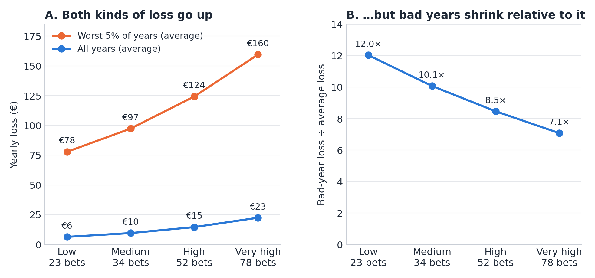

> **Disclaimer:** AI was used in the computational aspects and used to verify the analysis.

## Post-M3 Challenge

Following the 2026 MathWorks Math Modeling Challenge, a mathematics competition that incorporates both mathematical modeling and technical computing, I became more invested in the effects of gambling on individuals. During the competition, the central question – “Should society be concerned about online gambling and its continued growth?” – was broken down into three main parts: estimating disposable income, evaluating risk from demographics, and quantifying these predictions. Given that we only had 14 hours, there seemed to be so much more territory worth exploring post-comp.

Gambling in all forms is extremely prevalent on the internet, particularly on social media platforms, where algorithms dominate and manipulate users’ interests. It seemed like everyone was gambling, whether it was on their health (peptide craze), sports, and even on non-trivial things like the weather. The concept of gambling is becoming trivialized, and heavily integrated in today's world.

I decided to approach "gambling" itself from another angle. Simply, it's a decision involving a risk, calculated or not. As a chess player, we often go through online phases called a "tilt". Often ending up in anger, the "tilt" has tormented all players alike, including famous grandmasters as well. It includes a severe rating loss and dip in performance, as we try to play more games, hoping to minimize our losses. This can be seen in many examples, such as videogames, real gambling even, and more. The feedback loop is notoriously common.

We can focus on immediate rewards versus future rewards in this context. Playing chess games later in a clearer mindset is a much more rational choice than immediately trying to compensate in the very moment. This impatience – spurred by cumulating losses – ties to an idea called discounting. A person who prefers €10 now to €15 next week is placing a high value on getting a reward immediately. Researchers study this preference through a concept called **delay discounting**: how much waiting reduces the appeal of a reward.

That idea offers a possible starting point for thinking about gambling. Someone seeking an immediate reward might bet more frequently. After losing, they might also raise their next bet in an attempt to recover the money. But those are possible connections, not facts established by this simulation.

Essentially, the question is more limited than it appears: if people bet more often and become more likely to raise their bets after losing, what happens to their yearly losses?

The equation behind this behavioral idea is called **hyperbolic discounting**:

$$
V(D)=\frac{A}{1+kD}.
$$

Here, $A$ is the reward offered, $D$ is the wait, and $V(D)$ is how valuable that reward feels now. The parameter $k$ describes how strongly waiting reduces its appeal. For an illustrative example, a €15 reward arriving in one week has a present value of €12.50 when $k=0.2$ per week, but €7.50 when $k=1$ per week. The larger $k$ makes the immediate €10 more attractive.

This equation comes from the delay-discounting literature (Mazur, 1987; Green and Myerson, 2004). Research has also found an association between logged smartphone use and delay discounting (Schulz van Endert and Mohr, 2020), but an association does not establish which causes which.

Crucially, $k$ is background motivation, not an input to the gambling simulation; there is no computational role in the model. We use four assumed activity levels, indexed by $z=0,1,2,3$. We can therefore categorize the model through behavioral intensification, not as a model of hyperbolic discounting or impatience.

## Simulation Setup

We can simulate this by creating imaginary gamblers and establishing rules for their betting.
The model uses four activity levels, ranging from 23 to 78 bets per year. In the higher-activity scenarios, a loss is also more likely to trigger a larger next bet.

Normal bet sizes vary randomly, averaging €6.10. When a loss triggers a larger bet, the next bet is drawn from a range with an average 25% higher. It's a temporary increase.

Every bet has a 50% chance of winning, but a win pays only $10/11$ of the stake while a loss forfeits all of it. Each win and loss is recorded, along with the net result for the year. We use a **Monte Carlo simulation** of 200,000 years per scenario.

Some numbers were informed by published gambling research, but the changes between activity levels were assumptions chosen for the experiment. The main simulation also lets gamblers complete their scheduled bets without running out of money.

The precise scenario settings are:

| Scenario | Index $z$ | Annual bets $N$ | Probability that a loss triggers an elevated next bet |
|---|---:|---:|---:|
| Low | 0 | 23 | 5.0% |
| Medium | 1 | 34 | 9.5% |
| High | 2 | 52 | 17.4% |
| Very high | 3 | 78 | 29.6% |

“Very high” describes the highest activity level within this experiment; it does not correlate to severe gambling issues comparatively to the real world.

Bet frequency follows $N(z)=\operatorname{round}(23\cdot1.5^z)$. The escalation probabilities come from doubling the *odds* at each level:

$$
\operatorname{odds}(z)=\frac{2^z}{19},\qquad
p_C(z)=\frac{\operatorname{odds}(z)}{1+\operatorname{odds}(z)}.
$$

Odds and probability are different: odds of 1 to 19 mean one triggering outcome for every nineteen non-triggering outcomes, giving a probability of $1/20=5\%$. These formulas provide a consistent way to increase activity across scenarios (we assume the increases).

Normal stakes follow a **gamma distribution**, a pattern that generates positive bet sizes, with many modest bets and some larger ones. Its shape parameter is 2 and its mean is €6.10. Elevated stakes have the same shape and mean €7.625. Each person starts in the normal state. After any bet, only a loss followed by an escalation trigger makes the next stake elevated. An elevated bet can be followed by another elevated bet, but the model does not repeatedly multiply the previous stake by 1.25.

The €6.10 mean is anchored to the *median* stake reported by [Nelson et al. (2021)](https://doi.org/10.1556/2006.2021.00029), not their reported mean of €18.30. Likewise, the 25% increase is only loosely motivated by a finding about slot-machine play in [Zhang et al. (2024)](https://doi.org/10.1038/s41598-024-70738-3). It is not a measured response for the sports bettors represented here.

For a stake $s$, the expected loss per wager is

$$
\tfrac12s-\tfrac12\left(\tfrac{10}{11}s\right)=\frac{s}{22}.
$$

At a €6.10 stake, it is about €0.28. Each actual wager still either wins or loses.

## What is a Bad Outcome?

Looking only at the average can hide important differences. Two groups could lose the same amount on average, while one group has a small number of people who lose much more than everyone else.

To examine those bad outcomes, imagine sorting 100 yearly results from best to worst. Take the five worst years and calculate their average loss. This gives a measure of how expensive a particularly bad year can be.

The technical name is **CVaR95**. Here, it simply means the average loss in the worst 5% of simulated years. These extreme outcomes lie at one end, or “tail,” of the results, which is where the term *tail risk* comes from.

The simulation tested three predictions:

1. Average yearly losses would increase.
2. Losses in the worst years, and the chance of crossing specific loss amounts, would increase.
3. Losses in the worst years would grow proportionally faster than average losses.

The third prediction is stronger than the first two. If average losses doubled, it would require losses in the worst years to more than double.

The third prediction can be expressed with a single comparison:

$$
Q=\frac{\mathrm{CVaR}_{95,\text{high}}/\mathrm{CVaR}_{95,\text{low}}}
{\mathbb{E}[L_\text{high}]/\mathbb{E}[L_\text{low}]}.
$$

$L$ represents annual net loss, $\mathbb{E}[L]$ means average annual loss, and the subscripts "high" and "low" identify the higher- and lower-activity scenarios. If $Q>1$, worst-tail losses grow faster proportionally than mean losses. If $Q<1$, mean losses grow faster. This lets all the later experiments use the same test.

Annual net loss subtracts winnings from lost stakes. A person who ends the year ahead has a negative net loss. The reported average includes those winning years too.

## Failed Prediction

The comparison between the lowest and highest activity levels showed:

| Measure | Lower activity | Higher activity |
|---|---:|---:|
| Bets per year | 23 | 78 |
| Average yearly loss | €6.48 | €22.52 |
| Average loss in the worst 5% of years | €77.94 | €159.51 |

Both types of loss increased. But average losses became about **3.48 times as large**, while losses in the worst years became about **2.05 times as large**.

Using the baseline results gives

$$
Q\approx\frac{2.05}{3.48}=0.589.
$$

That is below 1, so the third prediction fails in the baseline. The two quantities being compared both increased; the ratio measures which increased faster.

The really bad years became more expensive, but they did not grow as quickly as the average.

Another way to express the difference is to compare a bad year with the average in its own group. In the lower-activity scenario, the average loss in the worst years was about 12 times the overall average loss. In the higher-activity scenario, it was about 7 times the overall average.

There is no contradiction: €159.51 is a larger loss than €77.94, but it is a smaller multiple of an average that has itself risen substantially.



The threshold results provide another view:

| Annual loss threshold | Probability in Very high divided by probability in Low |
|---|---:|
| More than €25 | 1.64 times |
| More than €50 | 3.25 times |
| More than €100 | 34.35 times |

The chance of losing more than €100 also became roughly 34 times as high. That is a comparison between probabilities, not a claim that 34% of gamblers lost that amount. Nor is €100 a universal measure of financial hardship. It is one fixed amount used to compare the scenarios. (€25 was chosen because it matches the median yearly net loss that Nelson et al. found among real online sports bettors; €50 and €100 are round numbers.)

A large probability ratio can arise when the starting probability is very small. These ratios alone do not tell the reader the percentage of gamblers crossing each threshold.

This is why the failed third prediction does not mean harm went away. When the whole distribution of losses shifts toward bigger numbers, many more years land past a fixed line like €100, even though the spread relative to the average shrinks. The shape of the tail and the chance of a costly year answer different questions.

A simulation is random, so its answers wobble slightly from run to run. To check how much, the 200,000 years were split into twenty separate batches of 10,000. The resulting 95% Monte Carlo intervals were:

| Measurement | Low | Very high |
|---|---:|---:|
| Mean annual loss | €6.33–€6.62 | €22.26–€22.79 |
| Average loss in worst 5% | €77.58–€78.26 | €158.77–€160.19 |

These intervals describe how precisely the computer estimates the answers under the specified rules. They do not tell us whether those rules accurately describe real people.

A separate experiment asked what changes when gamblers can run out of money, since the main simulation lets everyone keep betting no matter how much they have lost. With starting funds of about €152.50 (25 times the average normal bet), 4.16% of the Very-high simulated years exhausted those funds. The comparison ratio $Q$ fell from 0.584 without the restriction to 0.563 with it. This run used a separate set of random inputs, which explains why its unrestricted ratio differs slightly from the baseline's 0.589. Limiting available funds restricted the highest losses more strongly in the higher-activity group, making the third prediction harder to satisfy.

## Betting Quantity & Luck

Think about flipping a coin four times. Three heads would make heads 75% of the results. A short streak can dominate such a small sample.

Now imagine 1,000 flips. Streaks still happen, but the percentage of heads will usually be closer to 50%. Any one streak matters less compared with the total.

Repeated bets have a similar averaging effect in this model. Random wins and losses have more opportunities to offset one another, while each additional bet adds expected loss because of the house edge.

This does not mean someone who has lost several times is “due” to win. The next bet still has a 50% chance of winning. The averaging happens across many possible sequences, not because the game remembers earlier losses and compensates for them.

With more bets, luck contributes less relative to the growing average loss. The total losses can still become larger and more spread out in euros. What becomes smaller is their spread **compared with the average**.

## Increase from Behavior

Two things changed between the Low and Very-high scenarios: betting frequency and the chance of raising the next bet after a loss. To separate their effects, the simulation changed one at a time.

This experiment was a separate run with its own random draws, so its Low starting point (€6.43) differs slightly from the €6.48 in the earlier table. Increasing only the number of bets moved average losses from about €6.43 to €21.88. Increasing only the chance of a larger bet after losing moved them from about €6.43 to €6.62.

Under these rules, frequency accounted for most of the increase. Raising bets after losses also increased losses, but its effect was much smaller. A different, more aggressive rule for chasing losses could behave differently.

Measuring that small effect required a fair comparison. If two simulations receive different sequences of luck, the difference in their results can partly reflect luck rather than behavior. An early version of the code made exactly this mistake: it gave the Low and High scenarios independent random seeds, and the small escalation effect was buried in the noise.

The solution was to reuse matched random inputs across the comparisons. This is called **common random numbers**—roughly, comparing two strategies against the same underlying luck. It made the small effect easier to measure without making the effect itself larger.

## Python --> two effects

The Python experiment uses four cases: the Low reference, a frequency-only change, an escalation-only change, and both changes together. We can use a **decomposition**: changing the details separately to see which explains the result.

Here is the function that does it, from `impatience_simulation.py`. It relies on other parts of that program (such as `Scenario` and `simulate_paths`), so it won't run on its own.

```python
def decomposition(
    spec: ModelSpec, scenarios: list[Scenario], n_paths: int = 500_000
) -> pd.DataFrame:
    """Separate frequency and post-loss-response channels."""
    low, high = scenarios[0], scenarios[-1]
    cases = {
        "Low reference": low,
        "Frequency only": Scenario(
            "Frequency only", high.x, high.bets, low.p_chase
        ),
        "Escalation only": Scenario(
            "Escalation only", high.x, low.bets, high.p_chase
        ),
        "Combined": high,
    }
    rows = []
    common_seed = SEED + 500_000
    for name, s in cases.items():
        losses = simulate_paths(spec, s, n_paths, common_seed)
        rows.append(
            {
                "case": name,
                "bets": s.bets,
                "p_chase": s.p_chase,
                **summarize(losses),
            }
        )
    table = pd.DataFrame(rows)
    table.to_csv(OUT / "decomposition.csv", index=False)
    return table
```

The code creates four instruction sets and passes each to the same simulator. `high.bets` selects the higher bet count; `low.p_chase` keeps the lower probability of increasing a stake after a loss. In the escalation-only case, those choices reverse. The `high.x` field is just the scenario's position on the $z$ scale from earlier (Very high is $z=3$). It is carried along for bookkeeping, is not a measured impatience value, and the simulator never uses it.

`n_paths = 500_000` means half a million simulated years for each case. `summarize(losses)` calculates statistics from the resulting losses. Finally, `to_csv` saves a table that can be inspected separately from the program.

The shared `common_seed` starts each case from the same reproducible random-number seed. In the underlying simulator, how draws are generated and aligned determines the pairing. Reusing a seed is useful when it preserves matched random inputs; it does not by itself guarantee matching in every possible simulation design.

We get these results:

| Case | Bets per year | Escalation setting | Mean loss | CVaR95 |
|---|---:|---|---:|---:|
| Low reference | 23 | Low | €6.43 | €78.08 |
| Frequency only | 78 | Low | €21.88 | €153.24 |
| Escalation only | 23 | Very high | €6.62 | €81.24 |

The program also runs the combined case (both changes at once), but that row is left out here. The Very-high numbers in the earlier baseline table look similar, but they came from a different run with different random draws, so they should not be read as this table's fourth row.

The escalation-only mean-loss increase at 23 bets was about 3.0%, close to the 2.93% predicted by working the formula out by hand (an *analytical* calculation, with no simulation). That agreement is a check that the simulator is doing what it should. In a separate diagnostic at 78 bets, turning the elevated-stake multiplier from 1.00 to 1.25 increased mean loss by 3.64%, compared with 3.66% analytically.

These are different comparisons. The first changes how often escalation is triggered; the second switches the elevated-stake increase on. Their percentages should not be treated as interchangeable.

In the 78-bet diagnostic, matching random inputs reduced the variance of the estimated difference by about 223 times. That corresponds to roughly $\sqrt{223}=14.9$ times smaller standard error—a measure of the estimate's random fluctuation. The improvement made a small effect easier to detect; it did not change the underlying effect.

## Coincidence?

The project tested 162 combinations of assumptions, including different bet-size patterns and different increases after losses. None produced worst-year losses that grew proportionally faster than average losses. Many of these tests reflected the same averaging mechanism, so they should not be treated as 162 independent discoveries.

A mathematical proof provided a stronger result for a simpler version of the model. When bets are independent, follow the same rules, and only their number increases, the ratio of worst-tail loss to average loss cannot rise under the stated conditions.

The proof has a limited scope. It does not cover the full model, where losing can change the size of the next bet. The more complicated model was examined through simulation.

## Averaging Effect

This section gives the details behind the summary above: first the proof, then the 162 designs.

Let $Y_t$ be the net loss on bet $t$. Suppose bets are independent and follow the same distribution, with positive average loss $\mu$ and standard deviation $\sigma$. Standard deviation measures how widely outcomes vary around their average.

After $N$ bets,

$$
\mathbb{E}\left[\sum_{t=1}^{N}Y_t\right]=N\mu,
\qquad
\operatorname{SD}\left(\sum_{t=1}^{N}Y_t\right)=\sqrt{N}\sigma.
$$

Average loss grows in proportion to the number of bets. The standard deviation grows more slowly, in proportion to its square root. Four times as many bets therefore produces four times the average loss but only twice the standard deviation, under these assumptions.

Dividing one by the other gives

$$
\frac{\operatorname{SD}(\text{total loss})}{\mathbb{E}[\text{total loss}]}
=\frac{\sigma}{\mu\sqrt{N}}.
$$

The spread relative to the average shrinks as $N$ increases. This explains the mechanism, but standard deviation and CVaR measure different things. A separate argument is needed to prove the result for CVaR itself.

For that argument, let $S$ represent a person's overall betting scale, so annual loss becomes

$$
L_N=S\sum_{t=1}^{N}Y_t.
$$

$S$ can differ between people, but it must be nonnegative, independent of the per-bet outcomes, and drawn from the same distribution when comparing different bet counts. Assume its mean is positive and finite, the per-bet mean is positive and finite, and the relevant CVaR is finite.

Then the ratio

$$
R_N=\frac{\mathrm{CVaR}_\alpha(L_N)}{\mathbb{E}[L_N]}
$$

cannot increase with $N$. At $\alpha=0.95$, the numerator is the worst-5% average used throughout this post.

The proof relies on **convex order**, a precise way to say that one distribution has less spread than another while keeping the same mean. Averages of more independent, identically distributed bets decrease in this order. Multiplying by the same independent nonnegative scale $S$ preserves it, and CVaR respects the ordering. Since CVaR scales proportionally when all losses are multiplied by a positive constant,

$$
R_N=\mathrm{CVaR}_\alpha\left(
\frac{S\bar{Y}_N}{\mathbb{E}[S]\mu}
\right),\qquad
\bar{Y}_N=\frac{1}{N}\sum_{t=1}^{N}Y_t,
$$

which yields $R_{N+1}\le R_N$.

In plain language, averaging more independent bets cannot make the worst tail larger relative to the average under these conditions. This is a statement about the simplified model. The loss-triggered stake changes in the full simulation create dependence between wagers and fall outside that proof.

Returning to the 162 designs in more detail: this sensitivity sweep explored the fuller model numerically, with 30,000 simulated years for each group (low and high activity) in each design. It varied stake distributions, escalation sizes, frequency growth, escalation-odds growth, and differences in betting scale between people. All reported estimates of $Q$ stayed below 1; the largest was 0.839.

In 81 of the designs, each simulated person also got their own betting scale $S$ (the multiplier from the proof above), so some people bet much bigger amounts than others. $S$ followed a lognormal distribution with median €6.10, cut off at €1,930.87 (the largest stake Nelson et al. observed), and tuned with $\sigma\approx1.484$ so its mean matched their reported €18.30. The baseline simulation does not have this: there, everyone bets on the same scale.

Frequency growth explained 92.18% of the variation in $Q$ across the tested designs, and $Q$ had a correlation of 0.9728 with $1/\sqrt{N_\text{high}/N_\text{low}}$, the averaging factor from the formula above. In other words, most of the 162 results are the same averaging effect showing up again. These patterns support the averaging explanation within the sweep. They do not represent independent evidence that the model fits real-world behavior.

## Possible Reverse

So far, every person within an activity level had the same number of annual bets. But real gamblers differ: some bet occasionally, while others bet extremely often.

The next experiment allowed bet counts to vary between people. It asked what happens if the higher-activity group also has much greater differences between its members, including a small number of people making enormous numbers of bets.

That change could reverse the result. The extreme gamblers could push losses in the worst years up faster than average losses.

## The C++ experiment

The variable-count experiment draws annual bet counts from a **lognormal distribution**. This produces positive values with a long upper tail: many modest counts and a few extremely large ones. Its dispersion parameter controls how unequal those counts become.

The Python simulation handled everything up to this point, where every person in a group made the same number of bets. The follow-up C++ experiment executes every wager in the variable-count scenarios, including the rare years with enormous counts. C++ is suited to intensive loops, although Python could also implement this model. The methodological point is to simulate those rare paths directly rather than replace them with an approximation or cut them off, because those few years with enormous bet counts are exactly what drives the worst-5% average.

Here is the core loop from `random_count_exact.cpp`. The random generators, parameters, storage, and count calibration are defined elsewhere in the complete program.

```cpp
for (std::size_t i = 0; i < paths; ++i) {
  std::uint64_t n;
  if (sigma_count == 0.0) {
    n = static_cast<std::uint64_t>(std::llround(target_count));
  } else {
    double raw = std::exp(mu_count + sigma_count * normal(rng));
    n = std::max<std::uint64_t>(1, std::llround(raw));
    n = std::min(n, count_cap);
  }
  count_sum += n;
  count_sum_sq += static_cast<long double>(n) * n;
  count_max = std::max(count_max, n);

  bool elevated = false;
  double net = 0.0;
  for (std::uint64_t t = 0; t < n; ++t) {
    double stake = elevated ? elevated_stake(rng) : normal_stake(rng);
    bool win = uniform(rng) < q_win;
    net += win ? payout_multiple * stake : -stake;
    elevated = (!win) && (uniform(rng) < p_chase);
  }
  losses.push_back(-net);
}

long double loss_sum =
    std::accumulate(losses.begin(), losses.end(), 0.0L);
double mean = static_cast<double>(loss_sum / paths);
std::sort(losses.begin(), losses.end());
std::size_t tail_start = static_cast<std::size_t>(std::floor(0.95 * paths));
long double tail_sum = std::accumulate(
    losses.begin() + tail_start, losses.end(), 0.0L);
double cvar95 = static_cast<double>(tail_sum / (paths - tail_start));
```

The outer loop runs one simulated year at a time. It first chooses that year's number of bets, `n`. When `sigma_count` is zero, the count is fixed; otherwise `exp(...)` generates a lognormal count, which is rounded and kept at least 1.

The inner loop carries out all `n` bets. For each bet, it chooses a normal or elevated stake, generates a win or loss, updates the net balance, and decides whether the next bet will be elevated. The expression `(!win) && (...)` means both conditions must hold: the current wager loses, and a random draw triggers escalation.

`net` records profit, so `-net` converts that to loss. At the end, the program sorts annual losses from smallest to largest and averages the final 5%. With 200,000 years, that means averaging the 10,000 largest losses.

The complete program calibrates `mu_count` by bisection—repeatedly narrowing a search interval—so rounded counts have the intended mean. The visible `count_cap` is a safety limit set far above every count that actually came up in the reported runs, so it never cut anything off. That matters because a different cap did cause a real problem, described at the end of the next section.

## Reversed

The first variable-count experiments preserved group mean counts of 23 and 78 while allowing their dispersion to differ. Larger $\sigma$ means a wider spread in log counts and a more unequal count distribution.

| Count pattern | Low-group dispersion | High-group dispersion | Reported $Q$ | Worst-tail losses grew faster proportionally? |
|---|---:|---:|---:|---|
| Fixed counts, baseline | — | — | 0.589 | No |
| Equally dispersed random counts | 1.0 | 1.0 | 0.644 | No |
| Wider high-group counts | 1.0 | 1.8 | 0.967 | No |
| Still wider high-group counts | 1.0 | 2.2 | 1.117 | Yes |
| Alternative unequal-dispersion case | 0.5 | 2.0 | 1.222 | Yes |

The random-count values are averages across eight independent runs, each with 200,000 simulated years per group. The two values above 1 show that the third prediction can hold after changing the distribution of betting activity.


This does not contradict the proof: the proof assumed everyone in a group makes the same number of bets, and these experiments break that assumption. A much more unequal high-activity group can have extreme losses driven by a small number of very frequent gamblers.

## Reversal and plausible behavior

However, the examples that achieved this created a problem when compared with the available evidence.

To see why, consider ten people: nine make 10 bets each, and one makes 690. Their average is 78 bets per person, even though almost everyone makes just 10. The **median**, or middle value, is 10. A few extreme values can make the average describe the group poorly.

Something similar happened in the reversal experiment. Keeping the high-activity average at 78 bets pushed the implied median down to about 7—below the lower-activity group's median of about 14 (its average of 23 with a spread of 1.0). The supposedly higher-activity group then had a middle person who bet less often.

Keeping the middle person at 78 bets instead pushed the average much higher. In the tested reversal cases, average counts reached roughly 576 or 877 bets per year, well above the approximately 139 bets a year that real bettors averaged in Nelson et al.'s data (92.8 bets over eight months, scaled up to twelve).

The relationship comes from the lognormal formulas:

$$
\operatorname{median}(N)=\operatorname{mean}(N)e^{-\sigma^2/2},
\qquad
\operatorname{mean}(N)=\operatorname{median}(N)e^{\sigma^2/2}.
$$

These are formulas for the underlying continuous distribution; the simulation rounds counts to whole bets. They explain why preserving the mean pushes the median down as dispersion increases, while preserving the median pushes the mean up.


| High-group dispersion | Implied mean if its median is fixed at 78 |
|---|---:|
| 1.8 | About 394 bets/year |
| 2.0 | About 576 bets/year |
| 2.2 | About 877 bets/year |

Preserving the median did not remove the reversal. Reruns with no limit on bet counts produced $Q$ near 1.15 for dispersions $(1.0,2.2)$ and near 1.08 for $(0.5,2.0)$. The difficulty moved into the implied average activity.

The comparison data do show substantial differences between gamblers. Nelson et al.'s pooled eight-month sample had a mean count of 92.80, standard deviation of 374.12, and median of 15. Matching a lognormal distribution to the mean and standard deviation gives a dispersion parameter of about 1.69. Giving both groups that dispersion produced $Q=0.733$, which did not reverse the result.

The missing evidence is whether dispersion itself increases with measured impatience. Nelson et al.'s sample pools all bettors together, so it shows how varied people are overall, but not whether more impatient people are *more* varied, which is what the reversal needs.

Those comparisons raise questions about whether the tested scenarios describe real behavior. They do not prove that such groups cannot exist. The available data do not establish how betting patterns differ with measured impatience.

A coding check also mattered here. While revising, an AI-assisted review ran its own version of the median-preserving test and reported that the reversal disappeared. A second check could not reproduce that and found the reversal again. Comparing the two test programs showed why: the first review program (not the research code) stopped counting at 5,000 bets per year, which removed precisely the rare, very high-activity years driving the result. Removing that limit restored the reversal. The mathematical possibility survived; the question of realism remained.

## Revelations and conclusions

Under the model's assumptions, more betting leads to larger average losses, more expensive bad years, and a greater chance of crossing fixed loss amounts. At the same time, the worst outcomes can become smaller relative to the rising average because repeated bets reduce the relative influence of luck.

This is a limited model of gambling losses, not a prediction of bankruptcy or severe household harm (for research on that, see [Baker et al., 2026](https://www.sciencedirect.com/science/article/abs/pii/S0304405X26001017)). Its highest baseline activity level is only 78 bets per year, with an average loss of €22.52. It also does not establish that impatience causes people to gamble more.

The delay-discounting research makes it plausible that impatience plays a role in how often people bet, but this model assumes that link rather than testing it. What the model does show is what follows *if* it holds: more frequent betting costs more money in every sense measured here, and looking only at average losses would have missed most of the story: the average, the worst years, and the chance of crossing a fixed loss each moved differently.

That is why "smoother" should not be confused with "better." Someone who bets more often has yearly losses that are more predictable relative to their average, but that average is much larger.

The next question is narrower than the one that started this project: does measured impatience predict not only how often people bet on average, but also how *unequal* betting becomes within a group? Until data measure both, the fairest conclusion is that a reversal is mathematically possible, but the tested versions do not pass a reality check on both the average and the median.

## Reproducibility and references

The numbers above come from two programs: a Python simulation (the baseline, bankroll, decomposition, and 162-design checks) and a C++ program (the random bet-count experiments). The excerpts shown above are pieces of those programs and will not run on their own. The [code walkthrough]() is linked for the implementation context.

1. Mazur, J. E. (1987). [An adjusting procedure for studying delayed reinforcement](https://doi.org/10.4324/9781315825502). In M. L. Commons, J. E. Mazur, J. A. Nevin, & H. Rachlin (Eds.), *Quantitative Analyses of Behavior, Vol. 5: The Effect of Delay and of Intervening Events on Reinforcement Value*, 55–73. Erlbaum.
2. Green, L., & Myerson, J. (2004). [A discounting framework for choice with delayed and probabilistic rewards](https://doi.org/10.1037/0033-2909.130.5.769). *Psychological Bulletin*, 130(5), 769–792.
3. Schulz van Endert, T., & Mohr, P. N. C. (2020). [Likes and impulsivity: Investigating the relationship between actual smartphone use and delay discounting](https://doi.org/10.1371/journal.pone.0241383). *PLOS ONE*, 15(11), e0241383.
4. Nelson, S. E., Edson, T. C., Louderback, E. R., Tom, M. A., Grossman, A., & LaPlante, D. A. (2021). [Changes to the playing field: A contemporary study of actual European online sports betting](https://doi.org/10.1556/2006.2021.00029). *Journal of Behavioral Addictions*, 10(3), 396–411.
5. Zhang, K., Rights, J. D., Deng, X., Lesch, T., & Clark, L. (2024). [Within-session chasing of losses and wins in an online eCasino](https://doi.org/10.1038/s41598-024-70738-3). *Scientific Reports*, 14, 20353.
6. Baker, S. R., Balthrop, J., Johnson, M. J., Kotter, J. D., & Pisciotta, K. (2026). [Gambling away stability: Sports betting's impact on vulnerable households](https://www.sciencedirect.com/science/article/abs/pii/S0304405X26001017). *Journal of Financial Economics*. Earlier version: [NBER Working Paper No. 33108](https://www.nber.org/papers/w33108), 2024.
